  

 

---

## ▸ stack

**lenguajes & frontend**

  
  
  
  
  
  
  

**backend**

  
  
  
  

**datos**

  
  

**herramientas**

  
  
  
  
  
  

---

## ▸ proyectos

| proyecto | descripcion | stack |
|----------|-------------|-------|
| [Kropsale](https://github.com/Jn-Cod/Kropsale) | E-commerce full-stack: login seguro (JWT/bcrypt), carrito y funciones en tiempo real con WebSockets | `ts` `react` `next` `socket.io` `sqlite` |
| [Sistem](https://github.com/Jn-Cod/Sistem) | Sistema de planeaciones y reuniones: registro, login seguro y exportacion a PDF/DOCX sobre Turso | `js` `node` `express` `turso` `jwt` |
| [EMORA](https://github.com/Jn-Cod/EMORA) | Sitio web con zonas para ninos, adultos e instituciones, con inicio de sesion y registro | `html` `css` `js` |
| [mathfinger](https://github.com/Jn-Cod/mathfinger) | Herramienta web con ejercicios y logica de matematicas | `html` `css` `js` |

---

  
  
  

